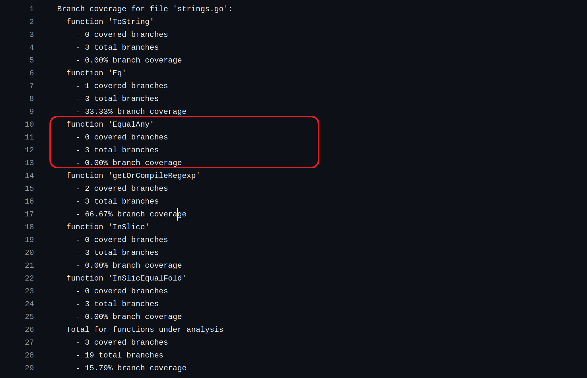
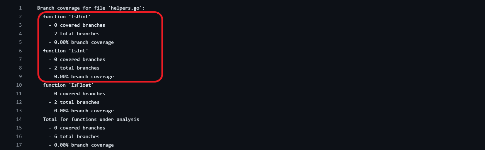

# Report for Assignment 1

###### Group Members
- Alessio Leonardo Tomei (lto223)
- Marco Trapasso (mtr237)
- Norah Elisabeth Milanesi (nmi245)

## Project chosen: [HUGO](https://github.com/gohugoio/hugo)


###### Lines of code 


&nbsp;  
###### Programming language (for test purposes): [*Golang*](https://go.dev/)


&nbsp;  
&nbsp;  
_______
_______
&nbsp;  
&nbsp;  
## Coverage measurement


### Existing tool

We made use of ***Golang*** built in testing tools.
We runned the following command to get *statement coverage output* in file `.cover.out`.
```
go test ./... -coverprofile .cover.out ./...
``` 
<br>

We can then format the output on the console with the following command.
```
go tool cover -func .cover.out
```
 <br><br>

We can alternatevely use the following command to open a html page where we can visually check the statement coverage for each file.
```
go tool cover -html .cover.out
```
>***NOTE:*** red statements are not reached, while green statements are. The following is just an example section.


 <br><br>

From the html GUI we were able to identify which packages / files lacked ***statement coverage*** and consequently thos that also lacked ***branch coverage***.
We chose to improve coverage of the package `hstrings` with file `strings.go`.

##### Statement Coverage Before Improvements

Total statement coverage [[complete file](covers/initial/cover_list.txt)]:


&nbsp;  
Statement coverage for package `hstrings` [[file]()]:


&nbsp;  
Statement coverage for package `hreflect` [[file]()]:


&nbsp;  
&nbsp;
_______
_______ 
&nbsp;  
&nbsp; 
## Test Coverage and Hierarchy

### Our Coverage Tool

Our own coverage tool focuses on branch coverage. We assigned a branch id that uniquely identifies the branch inside the packet (which usually means the file), so that each packet and its tests can be run independently.

>**PLEASE NOTE:** Our intention was to enhance coverage of the 6 functions with multiple branches that are present in the `strings.go` file. However, we discovered that the function `getOrCompileRegexp` had one unreachable branch (the if condition `if err != nil` can not not be reached since `Regexp.Compile()` always return a `nil` error). Therefore we had to find an additional file.


To keep track of the different branches we used the following logic.
```go
type BranchAnalyzer struct {
	// Name of the analyzed file.
	filename string
	// Boolean array where index number correspond to a branch (idx = branchId).
	// A value is set to true if the corresponding branch is reached.
	branches  [19]bool
	// Functions subject to analysis. Each function instance contains 
	// starting and ending branch ids (the branch ids that are reachable in the function body).
	functions [6]Function
}

type Function struct {
	name string
	startBranchId int8
	untilId int8
}

func (ba *BranchAnalyzer) reachedBranch(id int) {
	ba.branches[id] = true
}
```


&nbsp;  
The following function to format the resulting coverage.
```go

func (ba *BranchAnalyzer) getAnalysis() string {
	var sb strings.Builder
	totalCovered := 0
	totalBranches := len(ba.branches)
	sb.WriteString("Branch coverage for file '" + ba.filename + "':\n")
	for _, f := range ba.functions {
		numCoveredPerFunc := 0
		totalBranchesPerFunc := f.untilId - f.startBranchId
		for _, b := range ba.branches[f.startBranchId:f.untilId] { if b { numCoveredPerFunc++ } }
		totalCovered += numCoveredPerFunc
		sb.WriteString(fmt.Sprintf(
			"  function '%v'\n    - %v covered branches\n    - %v total branches\n    - %0.2f%% branch coverage\n",
			f.name,
			numCoveredPerFunc,
			totalBranchesPerFunc,
			100 * float32(numCoveredPerFunc) / float32(totalBranchesPerFunc),
		))
	}
	sb.WriteString(fmt.Sprintf(
		"  Total for functions under analysis\n    - %v covered branches\n    - %v total branches\n    - %0.2f%% branch coverage\n",
		totalCovered,
		totalBranches,
		100 * float32(totalCovered) / float32(totalBranches),
	))

	return sb.String()
}
```

&nbsp;  

And the following `TestMain` function to output the results to a file. The name makes it the entry point for the package tests execution.
```go
// Main function for tests. It allows to execute
// statements before and/or after all tests are executed.
// m.Run() runs all tests in the file.
func TestMain(m *testing.M) {
	exitCode := m.Run()
	f, _ := os.Create("branch_coverage.txt")
	defer f.Close()

	w := bufio.NewWriter(f)
	fmt.Fprintf(w, "%v", ba.getAnalysis())
	w.Flush()

	os.Exit(exitCode)
}
```


### Tests Hierarchy
All tests related to this assignment and in the same package were defined hierarchically in the same test group.
```
func TestForAssignments(t *testing.T) {
	t.Run(<testname>, <test>)
	...
}
```


&nbsp;  
&nbsp;
_______
_______ 
&nbsp;  
&nbsp; 
## Alessio
###### Setting Up
We set up our `BranchAnalyzer` [[commit](https://github.com/T0mexX/hugo-sep/commit/b2c03cb40f90bf92bbbe7aae49b229a3927ee393)].
```go
var ba = BranchAnalyzer{
	filename: "strings.go",
	branches: [19]bool{},
	functions: [6]Function{
		{name: "ToString", startBranchId: 0, untilId: 3},
		{name: "Eq", startBranchId: 3, untilId: 6},
		...
	},
}
```

&nbsp;  
***Function 1:*** `ToString` &nbsp;  
***File:*** `common/hstrings/strings.go`

```go
func ToString(v any) (string, bool) {
	switch vv := v.(type) {
	case string: // branch id = 0
		ba.reachedBranch(0)
		return vv, true
	case fmt.Stringer: // branch id = 1
	ba.reachedBranch(1)
		return vv.String(), true
	}
	// branch id = 2
	ba.reachedBranch(2)
	return "", false 
}
```

&nbsp;  
***Function 2:*** `Eq` &nbsp;  
***File:*** `common/hstrings/strings.go`

```go
func (s StringEqualFold) Eq(s2 any) bool {
	switch ss := s2.(type) {
	case string: // branch id = 3
		ba.reachedBranch(3)
		return s.EqualFold(ss)
	case fmt.Stringer: // branch id = 4
		ba.reachedBranch(4)
		return s.EqualFold(ss.String())
	}
	// branch id = 5
	ba.reachedBranch(5)
	return false 
}
```

&nbsp; 
###### Coverage Results Before Improvements

As we can see from both our own *branch coverage*, and the external *statement coverage* tools, there are 5 branches out of 6 that are not covered.


&nbsp;  
###### Tests
Consider also the following declarations, that are needed to perform the tests.
```go
type StringerImplementation struct{ str string }
func (si StringerImplementation) String() string { return si.str }
```

&nbsp;  
***Function 1:*** `ToString` [[commit](https://github.com/T0mexX/hugo-sep/commit/69cc0189e4c4f6af55c2d58bac4af44fc2495ac5)]&nbsp;  
***File:*** `common/hstrings/strings.go`

```go
t.Run("test for function 'ToString'", func(t *testing.T) {
		testCases := [3]struct {
			input        any
			expectedStr  string
			expectedBool bool
		}{
			{input: "a string", expectedStr: "a string", expectedBool: true},
			{
				input:        StringerImplementation{"This is a Stringer implementation."},
				expectedStr:  "This is a Stringer implementation.",
				expectedBool: true,
			},
			{input: 2, expectedStr: "", expectedBool: false},
		}

		for _, testCase := range testCases {
			t.Run(fmt.Sprintf("TestCase: %v", testCase), func(t *testing.T) {
				strOut, boolOut := ToString(testCase.input)
				assert.Equal(t, testCase.expectedStr, strOut)
				assert.Equal(t, testCase.expectedBool, boolOut)
			})
		}
	})
```
&nbsp;  

***Function 2:*** `Eq` [[commit](https://github.com/T0mexX/hugo-sep/commit/ef6119620725c841ea83af37731adf627bbde815)]&nbsp;  
***File:*** `common/hstrings/strings.go`

```go
t.Run("test for function 'Eq'", func(t *testing.T) {
		funReceiver := StringEqualFold("a string")
		testCases := [5]struct {
			input    any
			expected bool
		}{
			{input: "a string", expected: true},
			{input: "a string but the wrong one", expected: false},
			{input: "a string", expected: true},
			{input: StringerImplementation{"a string but the wrong one"}, expected: false},
			{input: 4, expected: false},
		}

		for _, testCase := range testCases {
			t.Run(fmt.Sprintf("TestCase: %v", testCase), func(t *testing.T) {
				boolOut := funReceiver.Eq(testCase.input)
				assert.Equal(t, testCase.expected, boolOut)
			})
		}
	})
```


&nbsp;  
###### Coverage Results After Improvements
Considering only these 2 functions, we went from *1/6* (*16.67%*) to *6/6* (*100%*) branches covered. Improving these 2 functions branch coverage concerned about passing parameter of different types. By defining test cases with parameter of type `string`, `Stringer` and a third different type (in our case `int`), we were able to reach all branches.


___

&nbsp;  

 

&nbsp;  
## Marco

###### Setting Up 

We set up our `BranchAnalyze` [[commit](https://github.com/T0mexX/hugo-sep/commit/b2c03cb40f90bf92bbbe7aae49b229a3927ee393)].


```go
var ba = BranchAnalyzer{
	filename: "strings.go",
	branches: [19]bool{},
	functions: [6]Function{
		...
		{name: "InSlice", startBranchId: 13, untilId: 16},
		{name: "InSlicEqualFold", startBranchId: 16, untilId: 19},
	},
}
```
&nbsp;  
***Function 1:*** `InSlice`           
***File:*** `common/hstrings/strings.go`

```go
func  InSlice(arr []string, el string) bool {
	for  _, v  :=  range arr {
		if v == el { // branch id = 13 (if condition evaluates to true at least once)
			ba.reachedBranch(13)
			return  true
		}
		// (else)
		// branch id = 14 (if condition evaluates to false at least once)
		ba.reachedBranch(14)
	}
	// (else)
	// branch id = 15 (if condition always evaluates to false)
	ba.reachedBranch(15)
	return  false
}
```
&nbsp;  
***Function 2:*** `InSliceEqualFold`      
***File:*** `common/hstrings/strings.go`
```go
func  InSlicEqualFold(arr []string, el string) bool {
	for  _, v  :=  range arr {
		if strings.EqualFold(v, el) { // branch id = 16 (if condition evaluates to true at least 	once)
			ba.reachedBranch(16)
			return  true
		}
		// (else)
		// branch id = 17 (if condition evaluates to false at least onece 
		ba.branch(17)
	}
	// (else)
	// branch id = 18 (if condition always evaluates to false)
	ba.reachedBranch(18)
	return  false

}
```


&nbsp;  
###### Coverage Result Before Improvements
By running our own branch coverage tool we have evaluated the branch coverage to 0/3 (0%) for both the functions.
&nbsp;  


&nbsp;  
By running the built-in go tools, we check the statement coverage of the function  `InSlice`  and `InSliceEqualFold`.


&nbsp;  
###### Tests
***Function 1:*** `InSlice` [[commit](https://github.com/gohugoio/hugo/commit/6f60dc6125af5db5f8221185e82453280c7250ae)].    
***File:*** `common/hstrings/strings.go`
```go

t.Run("test for function 'InSlice'", func(t *testing.T) {
	testCases := [6]struct {
		array_str  []string
		target_str string
		expected   bool
	}{
		{array_str: []string{"a", "string", "jennifer"}, target_str: "jennifer", expected: true},
		{array_str: []string{"eh", "io volevo", "te"}, target_str: "te", expected: true},
		{array_str: []string{"a", "string", "jennifer"}, target_str: "big", expected: false},
		{array_str: []string{}, target_str: "big", expected: false},
		{array_str: []string{}, target_str: "", expected: false},
		{array_str: []string{"     "}, target_str: "", expected: false},
	}

	for _, testCase := range testCases {
		t.Run(fmt.Sprintf("TestCase: %v", testCase), func(t *testing.T) {
			boolOut := InSlice(testCase.array_str, testCase.target_str)
			assert.Equal(t, testCase.expected, boolOut)
		})
	}
})
```
&nbsp;   
***Function 2:*** `InSliceEqualFold` [[commit](https://github.com/gohugoio/hugo/commit/6f60dc6125af5db5f8221185e82453280c7250ae)].  
***File:*** `common/hstrings/strings.go`

```go
t.Run("test for function 'InSliceEqualFold'", func(t *testing.T) {
	testCases := [6]struct {
		array_str  []string
		target_str string
		expected   bool
	}{
		{array_str: []string{"a", "string", "jennifer"}, target_str: "jennifer", expected: true},
		{array_str: []string{"eh", "io volevo", "te"}, target_str: "te", expected: true},
		{array_str: []string{"a", "string", "jennifer"}, target_str: "big", expected: false},
		{array_str: []string{}, target_str: "big", expected: false},
		{array_str: []string{}, target_str: "", expected: false},
		{array_str: []string{"     "}, target_str: "", expected: false},
	}

	for _, testCase := range testCases {
		t.Run(fmt.Sprintf("TestCase: %v", testCase), func(t *testing.T) {
			boolOut := InSlicEqualFold(testCase.array_str, testCase.target_str)
			assert.Equal(t, testCase.expected, boolOut)
		})
	}
})
```
&nbsp;  

In the red box below we show the outcome of the tests for `InSlice`  and `InSliceEqualFold`.
&nbsp;  


&nbsp;  


###### Coverage Result After Improvement

We improved the test coverage from 0 (0%) to 3/3 (100%) branches covered in both the functions. The function `InSlice` checks if a string is contained in an Array[] of strings. Additionally, the function `InSliceEqualFold` takes as parameters an Array[] of string and a string, it creates an `EqualFold` object with those two parameters and check if the string is contained in the Array[]. Thanks to this behavioural similarity we reused the same test adopted in the previous function (`InSlice)`.  
&nbsp;  


&nbsp;  

By running again the built-in go statement coverage tool we achieve a 100% statement coverage for both the functions. 
&nbsp;  


___

&nbsp;  
## Norah
###### Setting Up

***Function 1:*** `EqualAny` &nbsp;  
***File:*** `common/hstrings/strings.go`

The `BranchAnalyzer` and the flags for `common/hstrings/strings.go` was already set up ([commit](https://github.com/T0mexX/hugo-sep/commit/fd3a355808d73476661b655fafe999ec984622a5)):

```go
var ba = BranchAnalyzer{
	filename: "strings.go",
	branches: [19]bool{},
	functions: [6]Function{
		...
		{name: "EqualAny", startBranchId: 6, untilId: 9},
		...
	},
}
```

```go
func EqualAny(a string, b ...string) bool {
	for _, s := range b {
		if a == s { // branch id = 6 (if condition evaluates to true at least once)
			ba.reachedBranch(6)
			return true
		}
		// (else)
		// branch id = 7 (if condition evaluates to false at least once)
		ba.reachedBranch(7)
	}
	// branch id = 8 (if condition always evaluates to false)
	ba.reachedBranch(8)
	return false 
}
```


&nbsp;  
**Function 2:** `IsFloat` &nbsp;
**File:** `common/hreflect/helpers.go`

We set up our `BranchAnalyzer` for `common/hreflect/helpers.go` ([commit](https://github.com/T0mexX/hugo-sep/commit/fd3a355808d73476661b655fafe999ec984622a5)):

```go
var ba = BranchAnalyzer{
	filename: "helpers.go",
	branches: [6]bool{},
	functions: [3]Function{
		...
		{name: "IsFloat", startBranchId: 4, untilId: 6},
	},
}
```

and added flags in the function ([commit](https://github.com/T0mexX/hugo-sep/commit/97fc43e4f2f34f6b962e3d3f7fb4d5efacb2242e)):
```go
// IsFloat returns whether the given kind is a float.
func IsFloat(kind reflect.Kind) bool {
	switch kind {
	case reflect.Float32, reflect.Float64:
		ba.reachedBranch(4)
		return true // branch id = 4
	default:
		ba.reachedBranch(5)
		return false // branch id = 5
	}
}
```

&nbsp;
###### Coverage Result Before Improvements

**Function 1:** `EqualAny` &nbsp;  
**File:** `common/hstrings/strings.go`
As we can see, the branch coverage was 0%:




&nbsp;  
***Function 2:*** `IsFloat` &nbsp;  
***File:*** `common/hreflect/helpers.go` 

As we can see, the branch coverage was 0%:


&nbsp;


###### Tests

***Function 1:*** `EqualAny` [[commit](https://github.com/T0mexX/hugo-sep/commit/95a766930486ea4433912cd7bad2480c1df21ba1)]&nbsp;  
***File:*** `common/hstrings/strings.go`

```go
t.Run("test for function 'EqualAny'", func (t *testing.T) {
	testCases:= [5]struct {
		input1 string
		input2 string
		input3 string
		input4 string
		expected bool
	} {
		{input1: "random1", input2: "random1", expected: true},
		{input1: "random1", input2: "raandom", input3: "random1", input4: "random2", expected: true},
		{input1: "raandom1", input2: "raandom", input3: "random1", input4: "random2", expected: false},
		{input1: "random1", input2: "1", input3: "2", input4:"3", expected: false},
		{input1: "random1", input2: "random1", input3: "2", input4:"3", expected: true},
	}

	for _, testCase := range testCases {
		t.Run(fmt.Sprintf("TestCase: %v", testCase), func (t *testing.T) {
			boolOut := EqualAny(testCase.input1, testCase.input2, testCase.input3, testCase.input4)
			assert.Equal(t, testCase.expected, boolOut)
		})
	}
})
```


&nbsp;  
***Function 2:*** `IsFloat` [[commit](https://github.com/T0mexX/hugo-sep/commit/97fc43e4f2f34f6b962e3d3f7fb4d5efacb2242e)]&nbsp;
***File:*** `common/hreflect/helpers.go` 


```go
t.Run("test for function 'IsFloat'", func(t *testing.T) {

	testCases := [8]struct {
		input    reflect.Kind
		expected bool
	}{

		{input: reflect.Float32, expected: true},
		{input: reflect.Float64, expected: true},
		{input: reflect.Uint8, expected: false},
		{input: reflect.Uint16, expected: false},
		{input: reflect.Int, expected: false},
		{input: reflect.Int8, expected: false},
		{input: reflect.Bool, expected: false},
		{input: reflect.Chan, expected: false},
	}

	for _, testCase := range testCases {
		t.Run(fmt.Sprintf("TestCase: %v", testCase), func(t *testing.T) {
			boolOut := IsFloat(testCase.input)
			assert.Equal(t, testCase.expected, boolOut)
		})
	}
})
```


&nbsp;
&nbsp;
###### Coverage Results After Improvements

***Function 1:*** `EqualAny` &nbsp;  
***File:*** `common/hstrings/strings.go`

We went from *0* (*0%*) to *3/3* (*100%*) branches covered. The function takes multiple strings as parameter and checks if the first string provided is equal to any of the other input strings. To test the function we made a few test cases that check, given some input strings, if the return value is as expected.


&nbsp;  
**Function 2:** `IsFloat` &nbsp;
**File:** `common/hreflect/helpers.go`

We went from *0* (*0%*) to *3/3* (*100%*) branches covered. The function gets an input and then checks if, the given parameter, is of type `Float`. To test the function we made a few test cases that check, given different input types (`Uint`, `String`, `Bool`, `Int`, `Chan` and `Float`), that the outcome is as expected (ex: Uint8 -> False, Float8 -> True).


___
&nbsp; 
## Extra functions

###### Setting Up

We set up our `BranchAnalyzer` for `common/hreflect/helpers.go` ([commit](https://github.com/T0mexX/hugo-sep/commit/fd3a355808d73476661b655fafe999ec984622a5)):

```go
var ba = BranchAnalyzer{
	filename: "helpers.go",
	branches: [6]bool{},
	functions: [3]Function{
		{name: "IsUint", startBranchId: 0, untilId: 2},
		{name: "IsInt", startBranchId: 2, untilId: 4},
		...
	},
}
```

and added flags in the functions ([commit](https://github.com/T0mexX/hugo-sep/commit/97fc43e4f2f34f6b962e3d3f7fb4d5efacb2242e)):

&nbsp;     
***Function 1:*** `IsUint` &nbsp;  
***File:*** `common/hreflect/helpers.go`

```go
// IsUint returns whether the given kind is an uint.
func IsUint(kind reflect.Kind) bool {
	switch kind {
	case reflect.Uint, reflect.Uint8, reflect.Uint16, reflect.Uint32, reflect.Uint64:
		ba.reachedBranch(0)
		return true	// branch id = 0 
	default:
		ba.reachedBranch(1)
		return false	// branch id = 1 
	}
}
```

&nbsp;  
***Function 2:*** `IsInt` &nbsp;  
***File:*** `common/hreflect/helpers.go`

```go
// IsInt returns whether the given kind is an int.
func IsInt(kind reflect.Kind) bool {
	switch kind {
	case reflect.Int, reflect.Int8, reflect.Int16, reflect.Int32, reflect.Int64:
		ba.reachedBranch(2)
		return true // branch id = 2 
	default:
		ba.reachedBranch(3)
		return false // branch id = 3
	}
}
```

&nbsp;  
###### Coverage Results Before Improvements
As we can see, the branch coverage for both of the functions was 0%:


###### Tests


&nbsp;     
***Function 1:*** `IsUint` &nbsp;  
***File:*** `common/hreflect/helpers.go`


```go
t.Run("test for function 'IsUint'", func(t *testing.T) {

	testCases := [7]struct {
		input    reflect.Kind
		expected bool
	}{

		{input: reflect.Uint16, expected: true},
		{input: reflect.Uint32, expected: true},
		{input: reflect.Uint8, expected: true},
		{input: reflect.Uint64, expected: true},
		{input: reflect.Int, expected: false},
		{input: reflect.Bool, expected: false},
		{input: reflect.Chan, expected: false},
	}

	for _, testCase := range testCases {
		t.Run(fmt.Sprintf("TestCase: %v", testCase), func(t *testing.T) {
			boolOut := IsUint(testCase.input)
			assert.Equal(t, testCase.expected, boolOut)
		})
	}
})
```


&nbsp;
&nbsp; 
&nbsp;   
***Function 2:*** `IsInt` &nbsp;  
***File:*** `common/hreflect/helpers.go`


```go
t.Run("test for function 'IsInt'", func(t *testing.T) {

	testCases := [10]struct {
		input    reflect.Kind
		expected bool
	}{

		{input: reflect.Int8, expected: true},
		{input: reflect.Int16, expected: true},
		{input: reflect.Int32, expected: true},
		{input: reflect.Int64, expected: true},
		{input: reflect.Int, expected: true},
		{input: reflect.Bool, expected: false},
		{input: reflect.Chan, expected: false},
		{input: reflect.Uint16, expected: false},
		{input: reflect.Uint32, expected: false},
		{input: reflect.Uint8, expected: false},
	}

	for _, testCase := range testCases {
		t.Run(fmt.Sprintf("TestCase: %v", testCase), func(t *testing.T) {
			boolOut := IsInt(testCase.input)
			assert.Equal(t, testCase.expected, boolOut)
		})
	}
})
```


&nbsp;
&nbsp;
###### Coverage Results After Improvements


***Function 1:*** `IsUint` &nbsp;  
***File:*** `common/hreflect/helpers.go`

We went from *0* (*0%*) to *3/3* (*100%*) branches covered. The function gets an input and then checks if, the given parameter, is of type `Float`. To test the function we made a few test cases that check, given different input types (`Uint`, `String`, `Bool`, `Int`, `Chan` and `Float`), that the outcome is as expected (ex: Uint8 -> False, Float8 -> True).


&nbsp; 
***Function 2:*** `IsInt` &nbsp;  
***File:*** `common/hreflect/helpers.go`

We went from *0* (*0%*) to *3/3* (*100%*) branches covered. The function takes multiple strings as parameter and checks if the first string provided is equal to any of the other input strings. To test the function we made a few test cases that check, given some input strings, if the return value is as expected.


&nbsp;  
&nbsp;
_______
_______ 
&nbsp;  
&nbsp;  


***
&nbsp;  
### Alessio [[commit](https://github.com/T0mexX/hugo-sep/commit/b2c03cb40f90bf92bbbe7aae49b229a3927ee393)]


___


&nbsp;
### Norah
##### Function 1: `EqualAny` ([commit](https://github.com/T0mexX/hugo-sep/commit/95a766930486ea4433912cd7bad2480c1df21ba1))

###### Tests Results


&nbsp;
&nbsp;
###### Coverage improvement


&nbsp;
##### Function 2: `isFloat` ([commit](https://github.com/T0mexX/hugo-sep/commit/97fc43e4f2f34f6b962e3d3f7fb4d5efacb2242e))


&nbsp;
&nbsp;
###### Tests Results


&nbsp;
&nbsp;
###### Coverage improvement


___

&nbsp; 
>### Extra functions

##### Function 1: `IsInt` ([commit](https://github.com/T0mexX/hugo-sep/commit/97fc43e4f2f34f6b962e3d3f7fb4d5efacb2242e))

###### Code
```go
t.Run("test for function 'IsInt'", func(t *testing.T) {

	testCases := [10]struct {
		input    reflect.Kind
		expected bool
	}{

		{input: reflect.Int8, expected: true},
		{input: reflect.Int16, expected: true},
		{input: reflect.Int32, expected: true},
		{input: reflect.Int64, expected: true},
		{input: reflect.Int, expected: true},
		{input: reflect.Bool, expected: false},
		{input: reflect.Chan, expected: false},
		{input: reflect.Uint16, expected: false},
		{input: reflect.Uint32, expected: false},
		{input: reflect.Uint8, expected: false},
	}

	for _, testCase := range testCases {
		t.Run(fmt.Sprintf("TestCase: %v", testCase), func(t *testing.T) {
			boolOut := IsInt(testCase.input)
			assert.Equal(t, testCase.expected, boolOut)
		})
	}
})
```


&nbsp;
&nbsp;
###### Tests Results


&nbsp;
&nbsp;
###### Coverage improvement
We went from *0* (*0%*) to *3/3* (*100%*) branches covered. The function takes multiple strings as parameter and checks if the first string provided is equal to any of the other input strings. To test the function we made a few test cases that check, given some input strings, if the return value is as expected.

Before:



</br>
After:


&nbsp;
&nbsp;
##### Function 2: `isUint` ([commit](https://github.com/T0mexX/hugo-sep/commit/fd3a355808d73476661b655fafe999ec984622a5))

```go
t.Run("test for function 'IsUint'", func(t *testing.T) {

	testCases := [7]struct {
		input    reflect.Kind
		expected bool
	}{

		{input: reflect.Uint16, expected: true},
		{input: reflect.Uint32, expected: true},
		{input: reflect.Uint8, expected: true},
		{input: reflect.Uint64, expected: true},
		{input: reflect.Int, expected: false},
		{input: reflect.Bool, expected: false},
		{input: reflect.Chan, expected: false},
	}

	for _, testCase := range testCases {
		t.Run(fmt.Sprintf("TestCase: %v", testCase), func(t *testing.T) {
			boolOut := IsUint(testCase.input)
			assert.Equal(t, testCase.expected, boolOut)
		})
	}
})
```


&nbsp;
&nbsp;
###### Tests Results


&nbsp;
&nbsp;
###### Coverage improvement
We went from *0* (*0%*) to *3/3* (*100%*) branches covered. The function gets an input and then checks if, the given parameter, is of type `Float`. To test the function we made a few test cases that check, given different input types (`Uint`, `String`, `Bool`, `Int`, `Chan` and `Float`), that the outcome is as expected (ex: Uint8 -> False, Float8 -> True).

Before:


</br>
After:


&nbsp;  
###### Setting Up 

We set up our `BranchAnalyzer` ([commit]()).
```go
var ba = BranchAnalyzer{
	filename: "strings.go",
	branches: [19]bool{},
	functions: [6]Function{
		...
		{name: "InSlice", startBranchId: 13, untilId: 16},
		{name: "InSlicEqualFold", startBranchId: 16, untilId: 19},
	},
}
```
&nbsp;  
***Function1:*** `InSlice` &nbsp;  
***File:*** `common/hstrings/strings.go`

```go
func  InSlice(arr []string, el string) bool {
	for  _, v  :=  range arr {
		if v == el { // branch id = 13 (if condition evaluates to true at least once)
			ba.reachedBranch(13)
			return  true
		}
		// (else)
		// branch id = 14 (if condition evaluates to false at least once)
		ba.reachedBranch(14)
	}
	// (else)
	// branch id = 15 (if condition always evaluates to false)
	ba.reachedBranch(15)
	return  false
}
```
&nbsp;  
***Function2:*** `InSliceEqualFold` &nbsp;  
***File:*** `common/hstrings/strings.go`
```go
func  InSlicEqualFold(arr []string, el string) bool {
	for  _, v  :=  range arr {
		if strings.EqualFold(v, el) { // branch id = 16 (if condition evaluates to true at least 	once)
			ba.reachedBranch(16)
			return  true
		}
		// (else)
		// branch id = 17 (if condition evaluates to false at least once)
		ba.reachedBranch(17)
	}
	// (else)
	// branch id = 18 (if condition always evaluates to false)
	ba.reachedBranch(18)
	return  false

}
```

&nbsp;  
&nbsp;
_______
_______ 
&nbsp;  
&nbsp;  
## Overall


### Package ``hstrings``

Statement coverage before improvements [[file](common/hstrings/original_cover/statement_cover_list.txt)].


&nbsp;  
Statement coverage after improvements [[file](common/hstrings/statement_cover_list.txt)]:


&nbsp;  
### Package ``hreflect``

Statement coverage before improvements [[file](common/hreflect/initial/statement_cover_list.txt)].


&nbsp;  
Statement coverage after improvements [[file](common/hreflect/statement_cover_list.txt)]:


&nbsp;  
### All Packages
Statement coverage before improvements [[complete file](common/hstrings/original_cover/statement_cover_list.txt)].


&nbsp;  
Statement coverage after improvements [[complete file](covers/final/statement_cover_list.txt)]:

>***REMEMBER:*** The project has more than 200.000 lines of code.


## Statement of individual contributions

#### Alessio
- Improved coverage for functions `ToString` and `Eq` in file `common/hstrings/strings.go`.
- Added the `README.md` sections related to the above mentioned functions.

#### Marco
- Improved coverage for functions `InSlice` and `InSliceEqualFold` in file `common/hstrings/strings.go`
- Added the `README.md` sections related to the above mentioned functions.
 

#### Norah
- TODO
- TODO


#### Everyone
- Created the structures for measuring ***branch coverage***.
- Defined the function that formats the ***branch coverage*** to `branch_coverage.txt` file.
- Wrote introductory `README.md` section.
