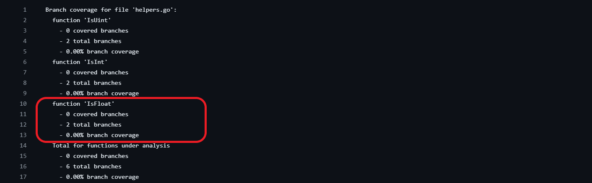
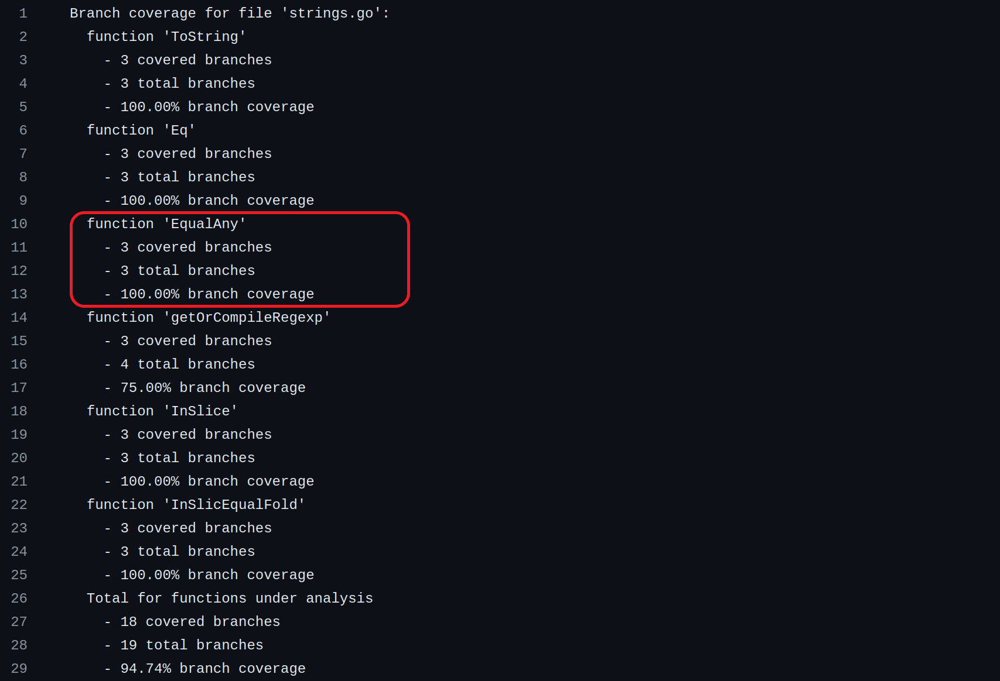

# Report for Assignment 1
*** ADD SOMETHING TO FILL THE GAP***

## Project chosen: [hugo](https://github.com/gohugoio/hugo)


##### Lines of code: 


##### Programming language (for test purposes): *Golang*

## Coverage measurement

### Existing tool

We made use of ***Golang*** built in testing tools.
We runned the following command to get *statement coverage output* in file `.cover.out`.
```
go test ./... -coverprofile .cover.out ./...
``` 
<br>

We can then format the output on the console with the following command.
```
go tool cover -func .cover.out
```
 <br><br>

We can alternatevely use the following command to open a html page where we can visually check the statement coverage for each file.
```
go tool cover -html .cover.out
```
 <br><br>

From the html GUI we were able to identify which packages / files lacked ***statement coverage*** and consequently thos that also lacked ***branch coverage***.
We chose to improve coverage of the package `hstrings` with file `strings.go`.

##### Statement Coverage

Statement coverage ([complete file](covers/initial/cover_list.txt)):


&nbsp;  
## Your own coverage tool

Our own coverage tool focuses on branch coverage. We assigned a branch id that uniquely identifies the branch inside the packet (which usually means the file), so that each packet and its tests can be run independently.

To keep track of the different branches we used the following logic.
```go
type BranchAnalyzer struct {
	// Name of the analyzed file.
	filename string
	// Boolean array where index number correspond to a branch (idx = branchId).
	// A value is set to true if the corresponding branch is reached.
	branches  [19]bool
	// Functions subject to analysis. Each function instance contains 
	// starting and ending branch ids (the branch ids that are reachable in the function body).
	functions [6]Function
}

type Function struct {
	name string
	startBranchId int8
	untilId int8
}

func (ba *BranchAnalyzer) reachedBranch(id int) {
	ba.branches[id] = true
}
```


&nbsp;  
The following function to format the resulting coverage.
```go

func (ba *BranchAnalyzer) getAnalysis() string {
	var sb strings.Builder
	totalCovered := 0
	totalBranches := len(ba.branches)
	sb.WriteString("Branch coverage for file '" + ba.filename + "':\n")
	for _, f := range ba.functions {
		numCoveredPerFunc := 0
		totalBranchesPerFunc := f.untilId - f.startBranchId
		for _, b := range ba.branches[f.startBranchId:f.untilId] { if b { numCoveredPerFunc++ } }
		totalCovered += numCoveredPerFunc
		sb.WriteString(fmt.Sprintf(
			"  function '%v'\n    - %v covered branches\n    - %v total branches\n    - %0.2f%% branch coverage\n",
			f.name,
			numCoveredPerFunc,
			totalBranchesPerFunc,
			100 * float32(numCoveredPerFunc) / float32(totalBranchesPerFunc),
		))
	}
	sb.WriteString(fmt.Sprintf(
		"  Total for functions under analysis\n    - %v covered branches\n    - %v total branches\n    - %0.2f%% branch coverage\n",
		totalCovered,
		totalBranches,
		100 * float32(totalCovered) / float32(totalBranches),
	))

	return sb.String()
}
```

&nbsp;  

And the following `TestMain` function to output the results to a file. The name makes it the entry point for the package tests execution.
```go
// Main function for tests. It allows to execute
// statements before and/or after all tests are executed.
// m.Run() runs all tests in the file.
func TestMain(m *testing.M) {
	exitCode := m.Run()
	f, _ := os.Create("branch_coverage.txt")
	defer f.Close()

	w := bufio.NewWriter(f)
	fmt.Fprintf(w, "%v", ba.getAnalysis())
	w.Flush()

	os.Exit(exitCode)
}
```

***
&nbsp;  

### Alessio
***Function1:*** `ToString` &nbsp;  
***File:*** `common/hstrings/strings.go`

***Function2:*** `Eq` &nbsp;  
***File:*** `common/hstrings/strings.go`


#### Setting Up
We set up our `BranchAnalyzer` ([commit]([text](https://github.com/T0mexX/hugo-sep/commit/b2c03cb40f90bf92bbbe7aae49b229a3927ee393))).
```go
var ba = BranchAnalyzer{
	filename: "strings.go",
	branches: [19]bool{},
	functions: [6]Function{
		{name: "ToString", startBranchId: 0, untilId: 3},
		{name: "Eq", startBranchId: 3, untilId: 6},
		...
	},
}
```

```go
func ToString(v any) (string, bool) {
	switch vv := v.(type) {
	case string: // branch id = 0
		ba.reachedBranch(0)
		return vv, true
	case fmt.Stringer: // branch id = 1
	ba.reachedBranch(1)
		return vv.String(), true
	}
	// branch id = 2
	ba.reachedBranch(2)
	return "", false 
}
```
```go
func (s StringEqualFold) Eq(s2 any) bool {
	switch ss := s2.(type) {
	case string: // branch id = 3
		ba.reachedBranch(3)
		return s.EqualFold(ss)
	case fmt.Stringer: // branch id = 4
		ba.reachedBranch(4)
		return s.EqualFold(ss.String())
	}
	// branch id = 5
	ba.reachedBranch(5)
	return false 
}
```
&nbsp;  
#### Coverage Result Before Improvements


&nbsp;  
## Coverage improvement


### Individual tests
All tests related to this assignment and in the same package were defined hierarchically in the same test group.
```
func TestForAssignments(t *testing.T) {
	t.Run(<testname>, <test>)
	...
}
```

***
&nbsp;  
### Alessio [[commit](https://github.com/T0mexX/hugo-sep/commit/b2c03cb40f90bf92bbbe7aae49b229a3927ee393)]
Consider also the following declarations, that are needed to perform the tests.
```go
type StringerImplementation struct{ str string }
func (si StringerImplementation) String() string { return si.str }
```

&nbsp;  
***Function1:*** `ToString` &nbsp;  
***File:*** `common/hstrings/strings.go`

```go
t.Run("test for function 'ToString'", func(t *testing.T) {
		testCases := [3]struct {
			input        any
			expectedStr  string
			expectedBool bool
		}{
			{input: "a string", expectedStr: "a string", expectedBool: true},
			{
				input:        StringerImplementation{"This is a Stringer implementation."},
				expectedStr:  "This is a Stringer implementation.",
				expectedBool: true,
			},
			{input: 2, expectedStr: "", expectedBool: false},
		}

		for _, testCase := range testCases {
			t.Run(fmt.Sprintf("TestCase: %v", testCase), func(t *testing.T) {
				strOut, boolOut := ToString(testCase.input)
				assert.Equal(t, testCase.expectedStr, strOut)
				assert.Equal(t, testCase.expectedBool, boolOut)
			})
		}
	})
```
&nbsp;  

***Function2:*** `Eq` &nbsp;  
***File:*** `common/hstrings/strings.go`

```go
t.Run("test for function 'Eq'", func(t *testing.T) {
		funReceiver := StringEqualFold("a string")
		testCases := [5]struct {
			input    any
			expected bool
		}{
			{input: "a string", expected: true},
			{input: "a string but the wrong one", expected: false},
			{input: "a string", expected: true},
			{input: StringerImplementation{"a string but the wrong one"}, expected: false},
			{input: 4, expected: false},
		}

		for _, testCase := range testCases {
			t.Run(fmt.Sprintf("TestCase: %v", testCase), func(t *testing.T) {
				boolOut := funReceiver.Eq(testCase.input)
				assert.Equal(t, testCase.expected, boolOut)
			})
		}
	})
```
&nbsp;  
#### Previous Coverage Results


&nbsp;  
#### Tests


&nbsp;  
#### Coverage Improvements
**Considering only these 2 functions**, we went from *1/6* (*16.67%*) to *6/6* (*100%*) branches covered. Improving these 2 functions branch coverage concerned about passing parameter of different types. By defining test cases with parameter of type `string`, `Stringer` and a third different type (in our case `int`), we were able to reach all branches.


### Marco

#### Setting Up 

We set up our `BranchAnalyzer` ([commit]()).
```go
var ba = BranchAnalyzer{
	filename: "strings.go",
	branches: [19]bool{},
	functions: [6]Function{
		...
		{name: "InSlice", startBranchId: 13, untilId: 16},
		{name: "InSlicEqualFold", startBranchId: 16, untilId: 19},
	},
}
```
&nbsp;  
***Function1:*** `InSlice` &nbsp;  
***File:*** `common/hstrings/strings.go`

```go
func  InSlice(arr []string, el string) bool {
	for  _, v  :=  range arr {
		if v == el { // branch id = 13 (if condition evaluates to true at least once)
			ba.reachedBranch(13)
			return  true
		}
		// (else)
		// branch id = 14 (if condition evaluates to false at least once)
		ba.reachedBranch(14)
	}
	// (else)
	// branch id = 15 (if condition always evaluates to false)
	ba.reachedBranch(15)
	return  false
}
```
&nbsp;  
***Function2:*** `InSliceEqualFold` &nbsp;  
***File:*** `common/hstrings/strings.go`
```go
func  InSlicEqualFold(arr []string, el string) bool {
	for  _, v  :=  range arr {
		if strings.EqualFold(v, el) { // branch id = 16 (if condition evaluates to true at least 	once)
			ba.reachedBranch(16)
			return  true
		}
		// (else)
		// branch id = 17 (if condition evaluates to false at least once)
		ba.reachedBranch(17)
	}
	// (else)
	// branch id = 18 (if condition always evaluates to false)
	ba.reachedBranch(18)
	return  false

}
```
&nbsp;  
#### Coverage Result Before Improvements


## Norah

### <span style="color: #006699;">Setting Up</span>

***Function 1:***`EqualAny` &nbsp;  
***File:*** `common/hstrings/strings.go`

The `BranchAnalyzer` and the flags for `common/hstrings/strings.go` was already set up ([commit]([text](https://github.com/T0mexX/hugo-sep/commit/b2c03cb40f90bf92bbbe7aae49b229a3927ee393))).

```go
var ba = BranchAnalyzer{
	filename: "strings.go",
	branches: [19]bool{},
	functions: [6]Function{
		...
		{name: "EqualAny", startBranchId: 6, untilId: 9},
		...
	},
}
```

```go
func EqualAny(a string, b ...string) bool {
	for _, s := range b {
		if a == s { // branch id = 6 (if condition evaluates to true at least once)
			ba.reachedBranch(6)
			return true
		}
		// (else)
		// branch id = 7 (if condition evaluates to false at least once)
		ba.reachedBranch(7)
	}
	// branch id = 8 (if condition always evaluates to false)
	ba.reachedBranch(8)
	return false 
}
```

As we can see, the branch coverage was 0:


***Function2:*** `IsFloat` &nbsp;  
***File:*** `common/hreflect/helpers.go`

Additionally, we set up our `BranchAnalyzer` for `common/hreflect/helpers.go` ([commit]([text](https://github.com/T0mexX/hugo-sep/commit/fd3a355808d73476661b655fafe999ec984622a5)))

```go
var ba = BranchAnalyzer{
	filename: "helpers.go",
	branches: [6]bool{},
	functions: [3]Function{
		...
		{name: "IsFloat", startBranchId: 4, untilId: 6},
	},
}
```
and added flags in the function ([commit](https://github.com/T0mexX/hugo-sep/commit/97fc43e4f2f34f6b962e3d3f7fb4d5efacb2242e))
```go
// IsFloat returns whether the given kind is a float.
func IsFloat(kind reflect.Kind) bool {
	switch kind {
	case reflect.Float32, reflect.Float64:
		ba.reachedBranch(4)
		return true // branch id = 4
	default:
		ba.reachedBranch(5)
		return false // branch id = 5
	}
}
```

As we can see, the branch coverage was 0:


&nbsp;  
### Coverage improvement

#### Individual tests

##### Function1: EqualAny

###### Code
```go
t.Run("test for function 'EqualAny'", func (t *testing.T) {
	testCases:= [5]struct {
		input1 string
		input2 string
		input3 string
		input4 string
		expected bool
	} {
		{input1: "random1", input2: "random1", expected: true},
		{input1: "random1", input2: "raandom", input3: "random1", input4: "random2", expected: true},
		{input1: "raandom1", input2: "raandom", input3: "random1", input4: "random2", expected: false},
		{input1: "random1", input2: "1", input3: "2", input4:"3", expected: false},
		{input1: "random1", input2: "random1", input3: "2", input4:"3", expected: true},
	}

	for _, testCase := range testCases {
		t.Run(fmt.Sprintf("TestCase: %v", testCase), func (t *testing.T) {
			boolOut := EqualAny(testCase.input1, testCase.input2, testCase.input3, testCase.input4)
			assert.Equal(t, testCase.expected, boolOut)
		})
	}
})
```

###### Tests Results


###### Coverage improvements
We went from *0* (*0%*) to *3/3* (*100%*) branches covered. The function takes multiple strings as parameter and checks if the first string provided is equal to any of the other input strings. To test the function we made a few test cases that check, given some input strings, if the return value is as expected.

***Before***


***After***



##### Function2: isFloat

```go
t.Run("test for function 'IsFloat'", func(t *testing.T) {

	testCases := [8]struct {
		input    reflect.Kind
		expected bool
	}{

		{input: reflect.Float32, expected: true},
		{input: reflect.Float64, expected: true},
		{input: reflect.Uint8, expected: false},
		{input: reflect.Uint16, expected: false},
		{input: reflect.Int, expected: false},
		{input: reflect.Int8, expected: false},
		{input: reflect.Bool, expected: false},
		{input: reflect.Chan, expected: false},
	}

	for _, testCase := range testCases {
		t.Run(fmt.Sprintf("TestCase: %v", testCase), func(t *testing.T) {
			boolOut := IsFloat(testCase.input)
			assert.Equal(t, testCase.expected, boolOut)
		})
	}
})
```


<Function 1 name>

<Show a patch (diff) or a link to a commit made in your forked repository that shows the instrumented code to gather coverage measurements>

<Provide a screenshot of the coverage results output by the instrumentation>

<Function 2 name>

<Provide the same kind of information provided for Function 1>

## Coverage improvement

### Individual tests

<The following is supposed to be repeated for each group member>

<Group member name>

<Test 1>

<Show a patch (diff) or a link to a commit made in your forked repository that shows the new/enhanced test>

<Provide a screenshot of the old coverage results (the same as you already showed above)>

<Provide a screenshot of the new coverage results>

<State the coverage improvement with a number and elaborate on why the coverage is improved>

<Test 2>

<Provide the same kind of information provided for Test 1>

### Overall

<Provide a screenshot of the old coverage results by running an existing tool (the same as you already showed above)>

<Provide a screenshot of the new coverage results by running the existing tool using all test modifications made by the group>

## Statement of individual contributions

<Write what each group member did>